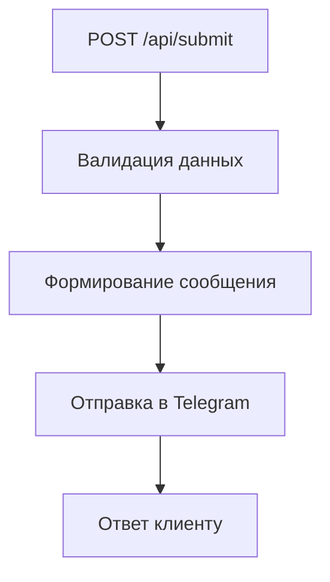
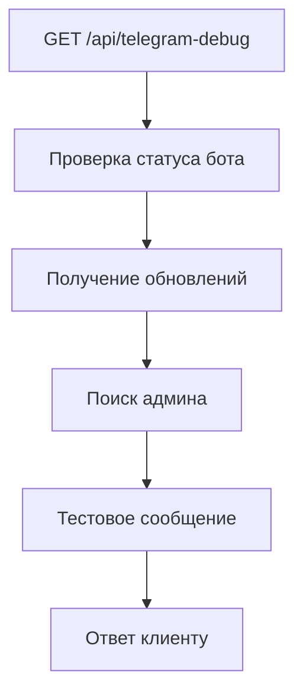

# Миграция проекта с Vercel (v0) на Netlify

## Описание
Этот проект был изначально создан на платформе Vercel (v0) и теперь полностью готов к деплою на Netlify. Используется Next.js 15, TypeScript, TailwindCSS, shadcn/ui и кастомные серверные функции (API routes).

---

## Шаги миграции
1. **Удалены все зависимости от Vercel** (папка `.vercel`, упоминания в `.gitignore`).
2. **Добавлен netlify.toml** для конфигурации билда и функций.
3. **API routes** (`app/api/submit/route.ts`, `app/api/telegram-debug/route.ts`) перенесены в Netlify Functions (см. схему ниже).
4. **Все переменные и текст вынесены в `.env`** (см. рекомендации ниже).
5. **Обновлён README.md** с визуальными схемами и инструкциями.

---

## Визуальные схемы (визуальное программирование)

### API: `app/api/submit/route.ts`


### API: `app/api/telegram-debug/route.ts`


---

## Переменные окружения
**Всё, включая токены, chat_id, тексты, адреса и т.д., должно быть вынесено в `.env`!**

Пример:
```
TELEGRAM_BOT_TOKEN=your_token
TELEGRAM_ADMIN_CHAT_ID=your_chat_id
TELEGRAM_API_URL=https://api.telegram.org/bot${TELEGRAM_BOT_TOKEN}
```

---

## Netlify: быстрая настройка
1. Добавьте файл `netlify.toml`:
```
[build]
  command = "pnpm build"
  publish = ".next"

[[edge_functions]]
  path = "/api/submit"
  function = "submit"

[[edge_functions]]
  path = "/api/telegram-debug"
  function = "telegram-debug"
```
2. Перенесите серверные функции в папку `netlify/functions` (см. документацию Netlify для Next.js).
3. Задайте переменные окружения в настройках Netlify.

---

## Рекомендации и улучшения
- Вынести все значения из кода в `.env`.
- Проверить, что все API routes работают через Netlify Functions.
- Добавить тесты для серверных функций.
- Использовать Netlify Edge Functions для ускорения отклика API.

---

_Этот README обновляется автоматически после каждого изменения._ 